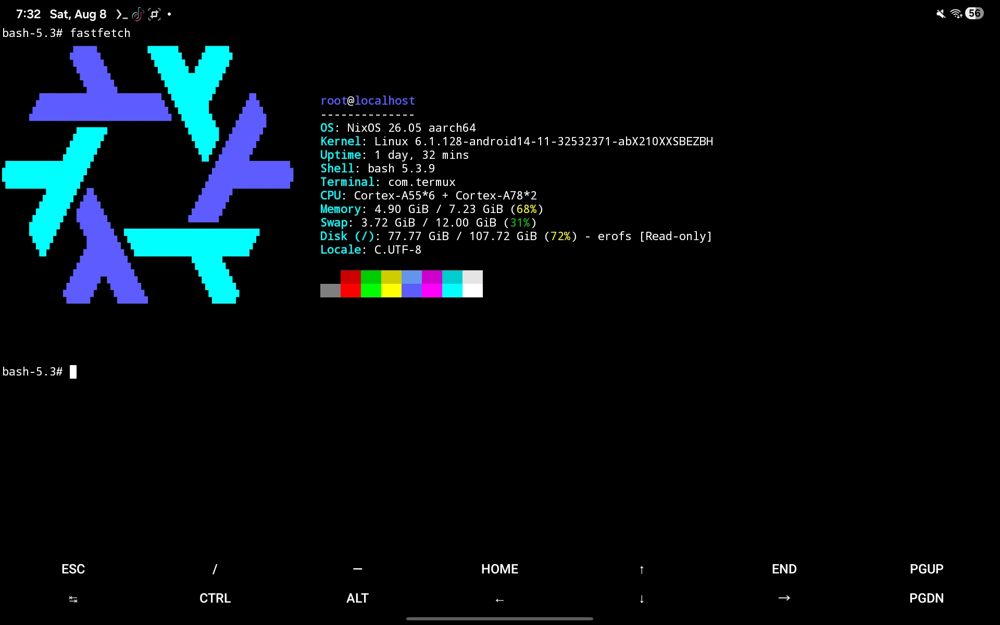

# nixos-android
## Testing
### Very unstable (nix doesnt work, fastfetch works [if u modify the whole thing])
NixOS for Android (this time im dumber kool)



## Installation

Open Termux and `run` this command:
```bash
wget -qO- "https://raw.githubusercontent.com/Shedeggsky/nixos-android/main/install.sh" | bash
```

## Getting Started
To launch your NixOS container, `run`:
```bash
./nixos.sh
```

To exit the container sessioin, `run`:
```bash
exit
```

To delete NixOS, `run`:
```bash
rm -f nixos.sh
chmod -R +w "nixos-fs" 2>/dev/null || true
rm -rf -f --no-preserve-root nixos-fs
```

## General Tips & Commands
Starting the VNC Server
Once inside the NixOS container, you can start the TigerVNC server using:
```bash
vncserver :(display) [for example, :1 for port 5901, :2 for port 5902 and so on.)
```
To kill the TigerVNC server, `run`:
```bash
vncserver :(display)
```
